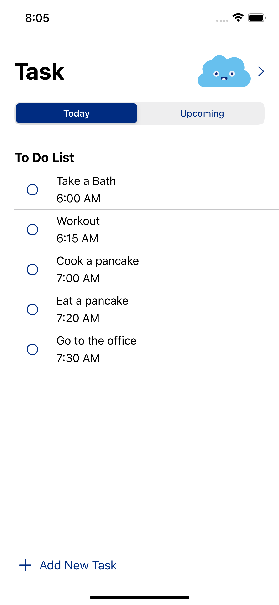
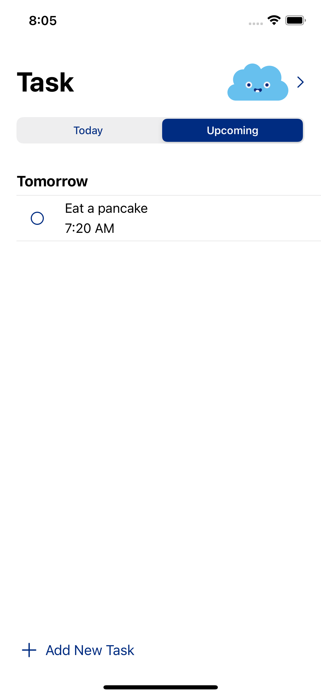
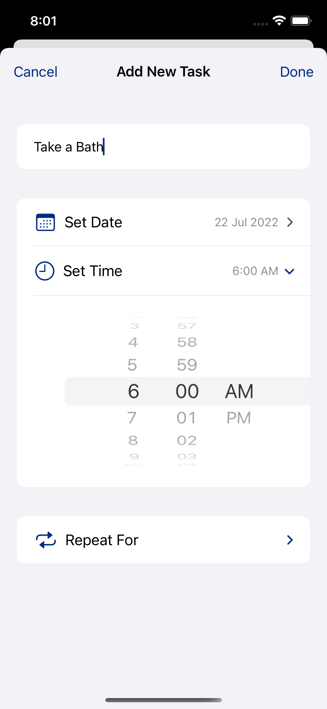
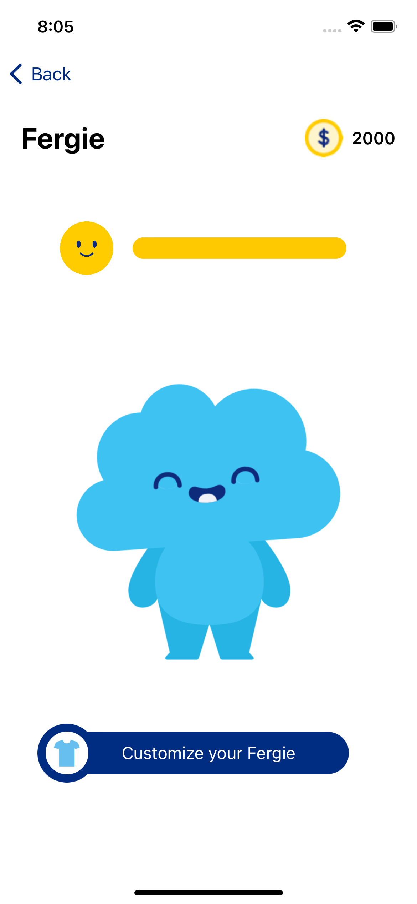
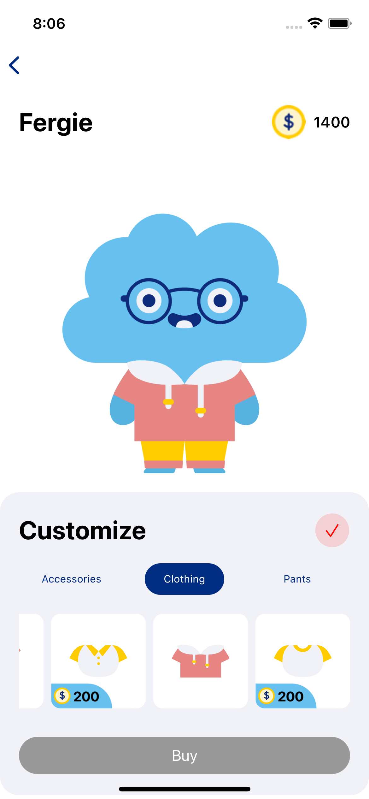
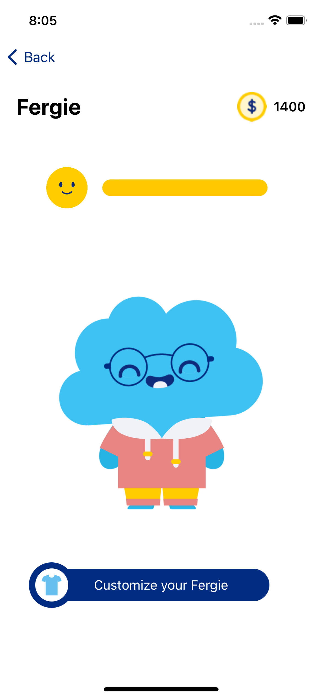
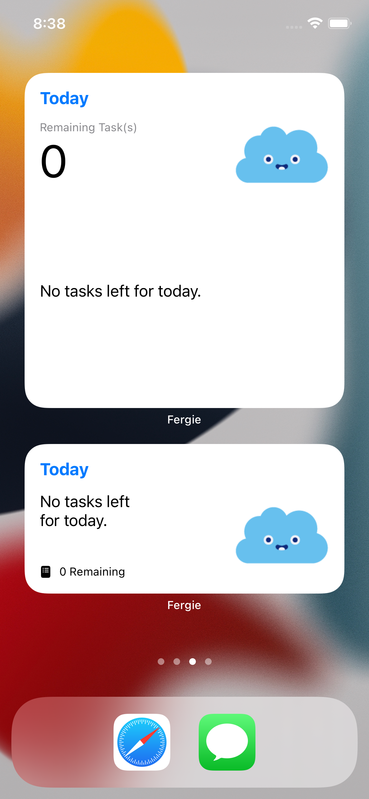
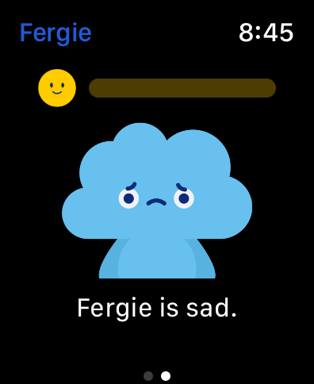

# Fergie
Fergie is an app for ADHD people to help them remember their tasks by having gamified reminder to increase their motivation.

## Tech Stack
**Platform:** iOS ``15.0`` 
**Framework:** SwiftUI, WidgetKit, WatchKit 
**IDE:** XCode ``v.13.4`` 

## Screenshots iOS

   
  
  
  
  
  

## Screenshots Widget

   

## Screenshots WatchOS

   

## Team
Coder 
[Candra Winardi](https://github.com/cndrtan) 
[Tinara Wiryonoputro](https://github.com/tinaranw) 
[Marshall Kurniawan](https://github.com/shrall) 

Designer 
[Cindy Kim](https://www.instagram.com/cindyckim/) 
[Farell](https://www.instagram.com/farrel_sfy/) 

Project Manager 
[Janice Kariyadi](https://www.instagram.com/janicekryd/) 

## Feedback
If there any feedback, please reach me out at candra.winardi@gmail.com

## Notes
Mini Challenge 2 and Nano Challenge 2 at Apple Developer Academy @ UC
